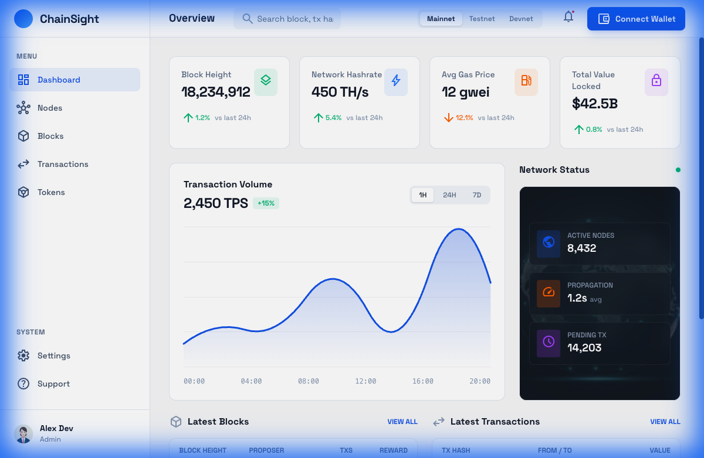
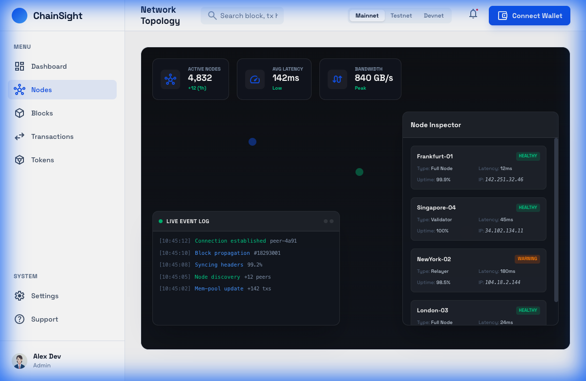
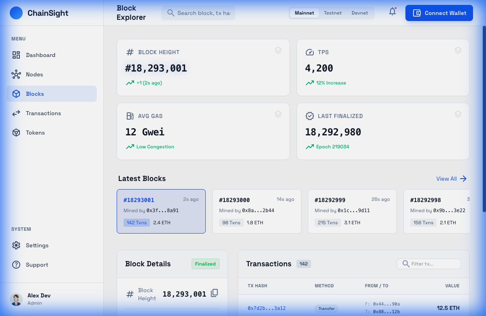
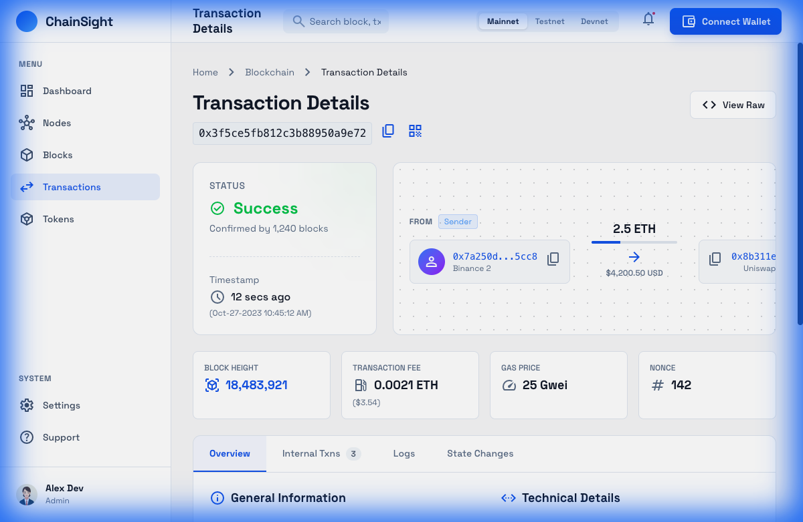
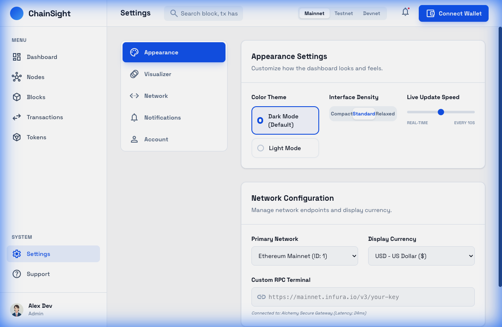

# ChainSight - Blockchain Visualizer & Monitoring

ChainSight is a high-performance blockchain dashboard and monitoring application designed to provide real-time insights into blockchain networks, transactions, and wallet activities.

## Features

- **Dashboard**: High-level overview of network health, top blocks, and transactions.
- **Transaction Explorer**: Deep dive into transaction status, flow, and technical logs.
- **Block Explorer**: Analyze block data, rewards, and historical trends.
- **Wallet Monitor**: Track portfolio performance and interaction visualizations.
- **Network Topology**: Real-time view of node connectivity and propagation logs.

## Tech Stack

- **Frontend**: React, TypeScript, Tailwind CSS
- **Build Tool**: Vite
- **Icons**: Material Symbols

## Application Preview

### Dashboard



### Network Topology



### Block Explorer



### Transaction Details



### Wallet Monitor


### Settings



## Getting Started

```bash
npm install
npm run dev
```
